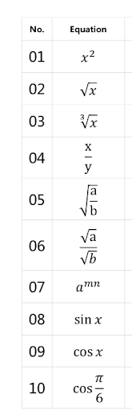

# cs101aFinal
## Handwritten math expression recognition algorithm.
 

This repository contains the data and code used to train a convolutional neural network (CNN) to recognize and classify handwritten mathematics expressions in 10 classes, specified below.

The algorithm expects the expressions to have the same form, but not the same characters. Any character shown in the equation column can be used with any class.

For example, valid expressions for class 01 are x2, b6, ny, etc. Therefore, the difference between class 01 and class 07 is simply a multiplicand in the exponent. 

# What you need

To run this, you will need to have Anaconda/miniconda installed. See [here](https://www.anaconda.com/) for more information. 

First, download the repository. 

Then, in a terminal, run the command:

>conda env create -f YOUR_PATH_HERE/cs101aFinalRomer.yml

This should download all required libraries and create the virtual environment used to run both the Jupyter notebook (training the model) and the main.py file in the cs101aFinalClassification directory.

To activate the environment, run:

>conda activate cs101aFinalRomer

# Running the image classification program (cs101aFinalClassification/main.py)

### From the command line:

>python3 YOUR_PATH_HERE/cs101aFinalClassification/main.py

### From VSCode:

<ol>
    <li>Open VSCode (or any IDE).</li>
    <li>Open up the cs101aFinalClassification folder. Open the entire folder in the IDE (e.g. in the terminal, run `code .` while in the cs101aFinalClassification folder).</li>
    <li>Ensure that your Python interpreter is set to the the cs101aFinalRomer environment, and run the main.py. Final_Model.pt should be in the same folder as main.py</li>
</ol>

# What the program expects

This image classification model expects a directory of png images. 

# Running the model training program

This is done in a Jupyter-lab notebook.

To start, you must have jupyter installed. If not, run:

> conda install -c anaconda jupyter 

Then, while in a terminal window, simply cd to cs101aFinalTraining and run the command:

>jupyter-lab

All required packages should have been installed through conda, as described earlier.
